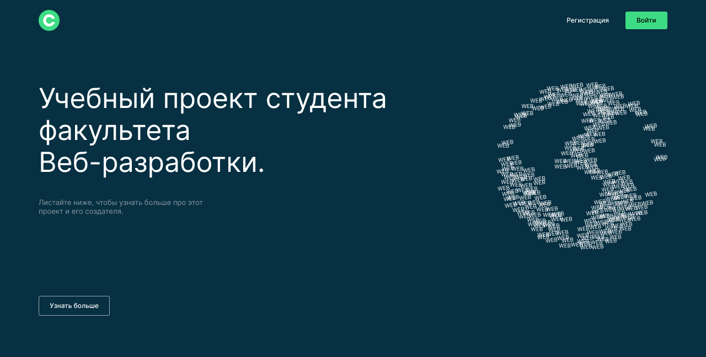
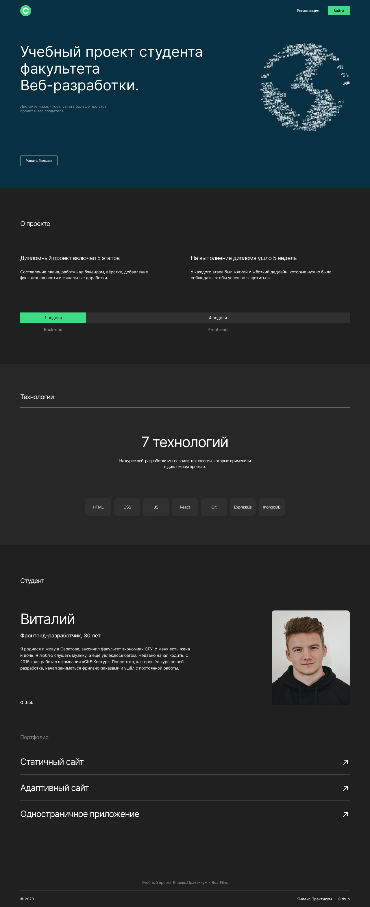
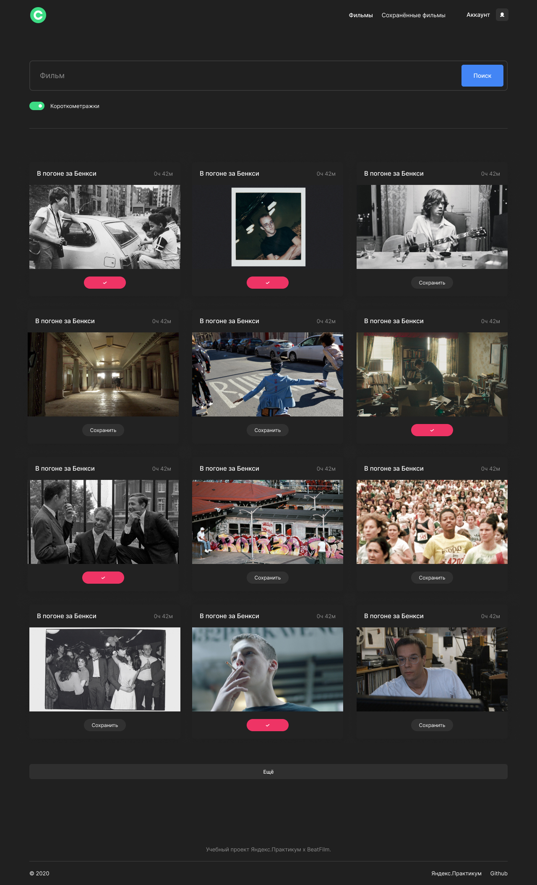
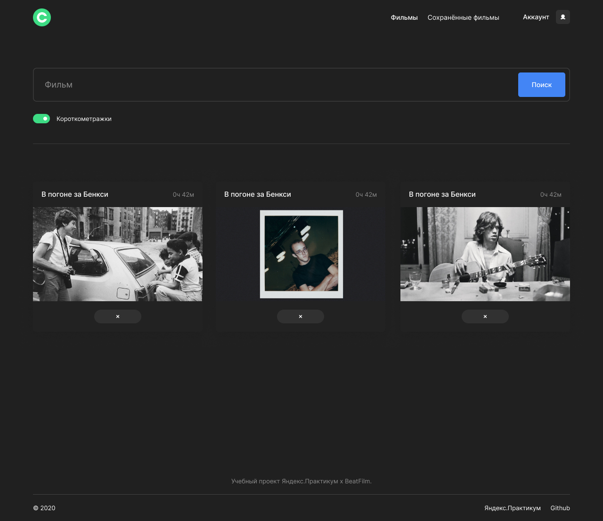
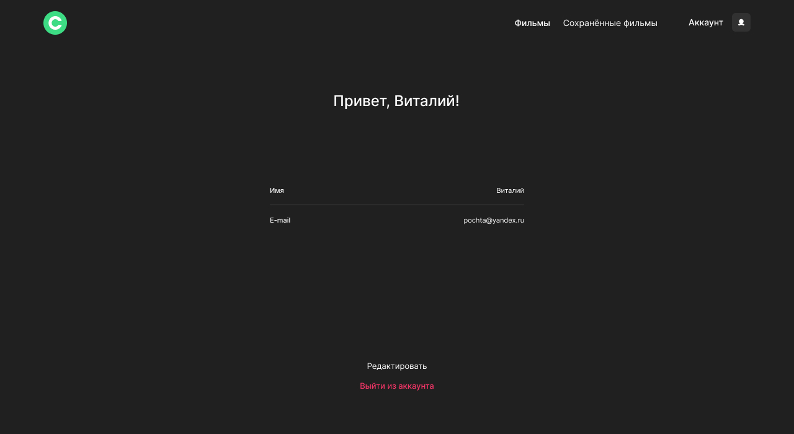
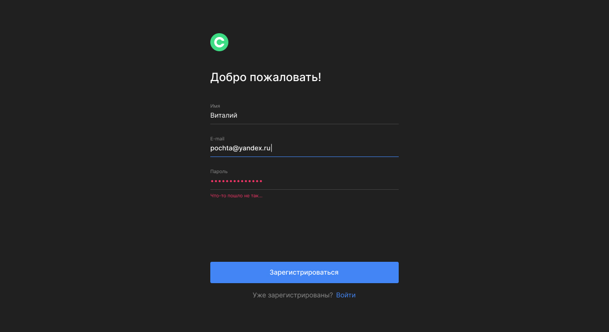

  <h1 align="center">Проект <a style="color: #4285B4;" href="https://shekko777.github.io/react-mesto-auth/" target="_blank">movies-explorer-frontend</a> 


---

<div align="center" ></div>

<div align="center">

   

</div>

---

<h2 style="color: #4285B4;" >Ссылка на пулреквест:</h2>

```
вставлю ссылку
```

<h2 style="color: #4285B4;" >Ссылка на задеплоенный проект:</h2>

```
вставлю ссылку
```

<h2 style="color: #4285B4;" >Ссылка на макет:</h2>

```
https://www.figma.com/file/6FMWkB94wE7KTkcCgUXtnC/%D0%94%D0%B8%D0%BF%D0%BB%D0%BE%D0%BC%D0%BD%D1%8B%D0%B9-%D0%BF%D1%80%D0%BE%D0%B5%D0%BA%D1%82?type=design&node-id=1%3A11315&mode=design&t=2tEX890qdpTVww9n-1
```

<h2 style="color: #4285B4;" >Скачать и начать:</h2>

<p>Скачайте проект локально</p>

```
git clone https://github.com/Shekko777/movies-explorer-frontend.git
```

<p>Установите пакет зависимостей</p>

```
  npm i
```

<p>Включите локальный сервер в проекте:</p>

```
npm run start
```

---

<h2 style="color: #4285B4;">О проекте:</h2>

<p style="width: 600px; font-weight: 500"><span style="padding: 5px; background-color: #F5F5F5; font-weight: 700;">web-приложение</span> с настройкой личного профиля, функцией авторизации и регистрации, просмотра фильмов на общей базе данных, сохранение и удаление фильмов в ваш аккаунт.</p>

---

<div style="display: flex; align-items: start; margin-bottom: 20px;"><h2 style="color: #4285B4; display: inline; margin-right: 20px;">Работа с кодом:</h2>  </div>

<p style="width: 600px"><span style="font-weight: 800">1. Компоненты фильмов.</span> на создание карточек сохранённых, и общих фильмов используется один компонент</p>

```
 const MoviesCard = ({ film, savedFilm }) => {
  const ref = React.useRef();
  const [isSaved, setIsSaved] = React.useState(film.saved);

  const handleRemoveMovie = () => {
    ref.current.remove();
  }

  const handleSaveButton = () => {
    setIsSaved(!isSaved);
  }

  if (savedFilm) {
    return (
      <li ref={ref} className="movies__card">
        <div className="movies__card-info">
          <p className="movies__card-name">{film?.name}</p>
          <p className="movies__card-time">{film?.time.hours}ч {film?.time.minutes}м</p>
        </div>
        
        <button onClick={handleRemoveMovie} className="movies__card-button"></button>
      </li>
    )
  } else {
    return (
      <li className="movies__card">
        <div className="movies__card-info">
          <p className="movies__card-name">{film?.name}</p>
          <p className="movies__card-time">{film?.time.hours}ч {film?.time.minutes}м</p>
        </div>
        
        {isSaved ? (
          <button onClick={handleSaveButton} className="movies__card-button movies__card-button_type_saved" type="button"></button>
        ) : (
          <button onClick={handleSaveButton} className="movies__card-button" type="button">Сохранить</button>
        )}
      </li>
    )
  }
};

```

<p style="width: 600px"><span style="font-weight: 800">2. Список фильмов.</span> Фильмы отображаются в компоненте MoviesCardList, который так же переиспользуется и в сохранённых, и на общей странице.</p>

```
  import './MoviesCardList.css';
const MoviesCardList = ({ movies, children }) => {
  return (
    <ul className={movies ? "movies__list" : "movies__list movies__list_empty"} >
      {children}
    </ul>
  )
}

export default MoviesCardList;
```


---

<h2 style="color: #4285B4;"> Скринкаст приложения:</h2>

<div align="center">

  <h4>Главная страница</h4>

  

  <h4>Общие фильмы</h4>

  

  <h4>Сохранённые фильмы</h4>

  

  <h4>Аккаунт</h4>

  

  <h4>Регистрация / авторизация</h4>

  
</div>

<h3 style="opacity: 0.3;">© Created by Shekko.</h3>
